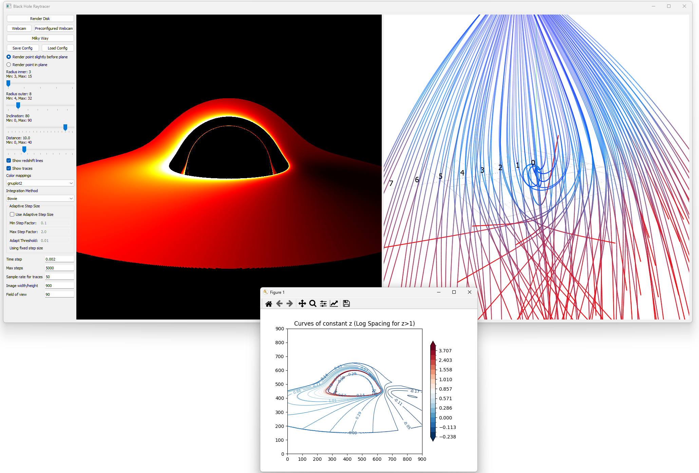
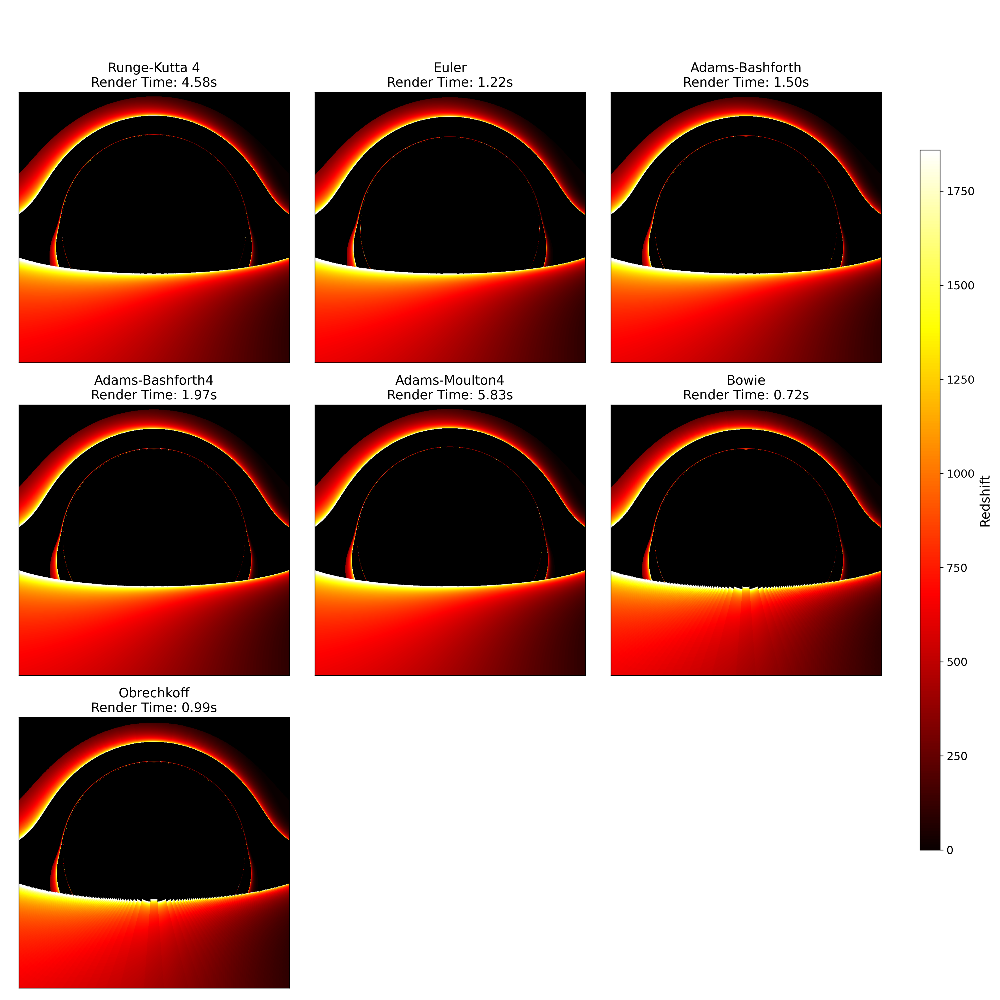
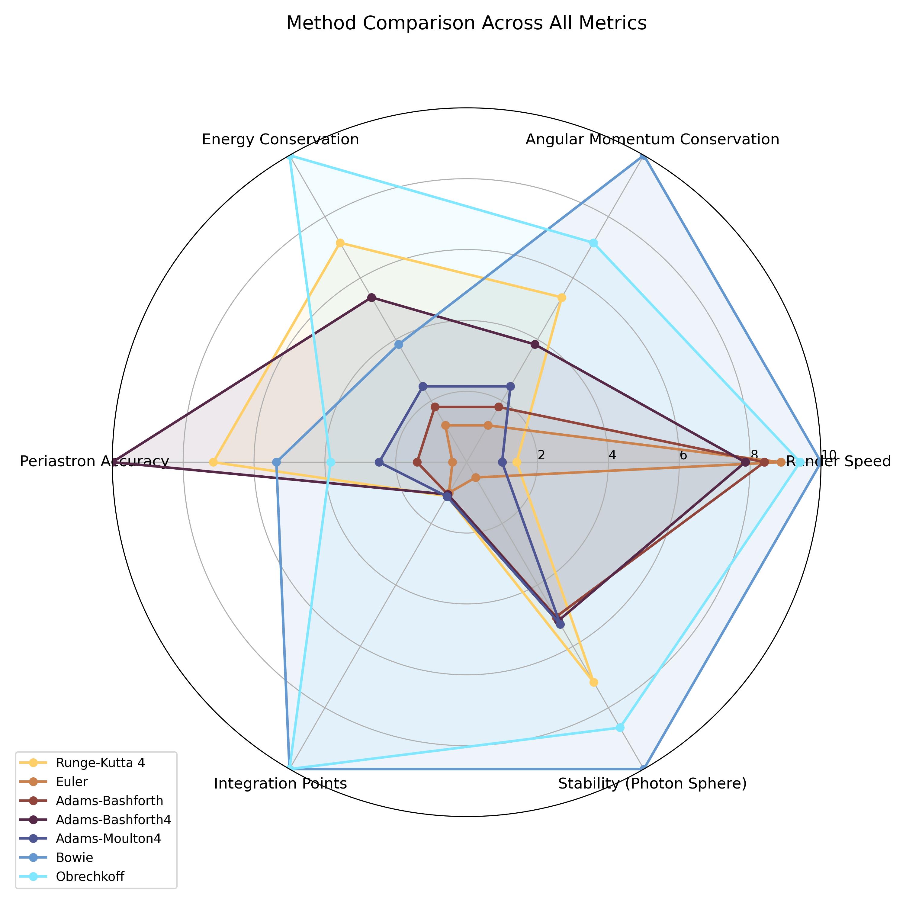
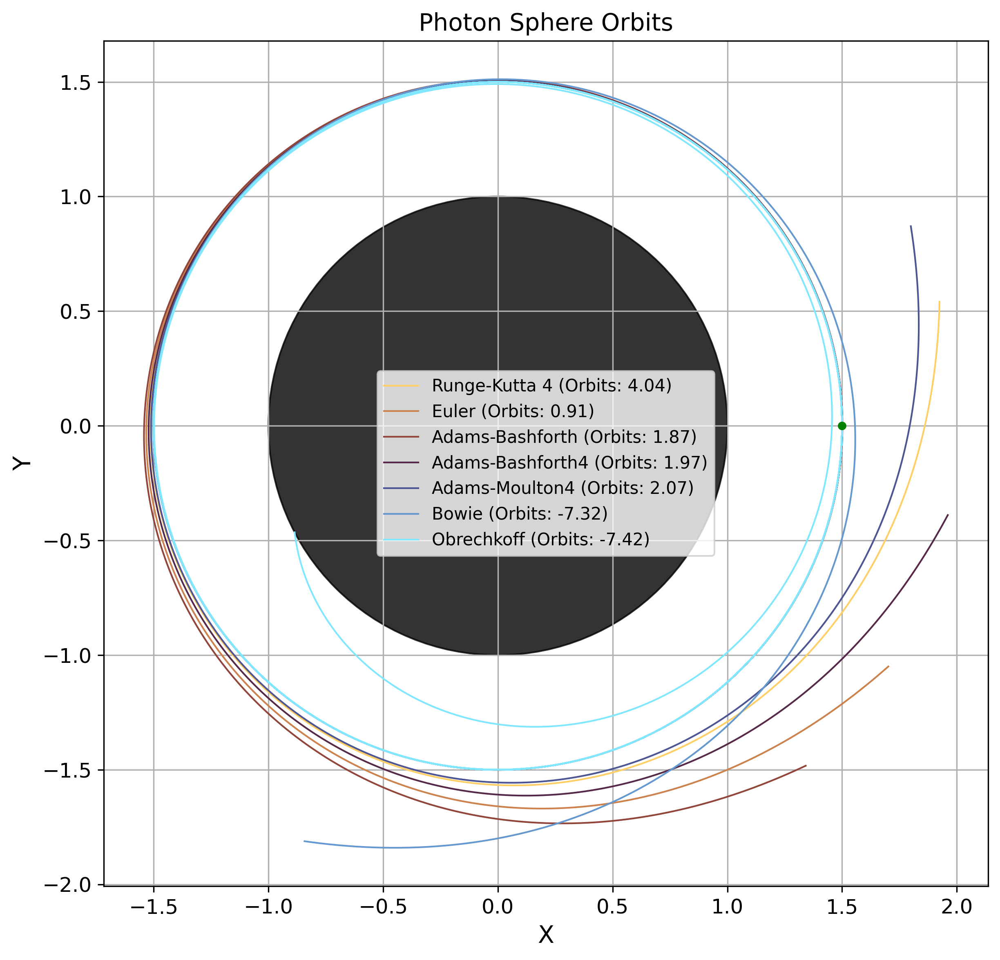

# Black Hole Raytracer

[](https://opensource.org/licenses/MIT)

A CUDA-accelerated numerical relativity raytracer for Schwarzschild black holes, comparing seven numerical integration methods — including two novel integrators derived specifically for the Binet-form geodesic equation.

<p align="center">
  
  <br><em>The interactive GUI on first launch: accretion disk render, 3D trajectory view, redshift contours, and real-time parameter controls.</em>
</p>

<p align="center">
  
  <br><em>Accretion disk renders from all seven integrators at inner radius r_in = 3 r_s. Methods produce visually consistent results while differing in speed, conservation, and stability by orders of magnitude.</em>
</p>

---

## Key Results

- **Seven integrators benchmarked**: Runge-Kutta 4, Euler, Adams-Bashforth, Adams-Bashforth 4, Adams-Moulton 4, and two novel methods (Bowie, Obrechkoff)
- **Bowie method**: A 4th-order explicit Taylor-series integrator achieving the highest photon sphere stability (7.3+ orbits) and best angular momentum conservation (~7 x 10^-13% relative error)
- **Obrechkoff method**: A 4th-order implicit integrator with analytical Jacobian, achieving best energy conservation (~2 x 10^-9% relative error) — the only method spiraling inward at the photon sphere, indicating fundamentally different error propagation
- **Performance**: Bowie and Obrechkoff render 900 x 900 accretion disk images 6-8x faster than RK4 at the same step size, primarily because their φ-integration requires drastically fewer steps for weakly-deflected paths

<p align="center">
  
  <br><em>Multi-metric comparison across render speed, AM conservation, energy conservation, periastron accuracy, integration efficiency, and photon sphere stability.</em>
</p>

---

## Quick Start

```bash
git clone https://github.com/<your-username>/blackhole-raytracer.git
cd blackhole-raytracer
uv sync
uv run main.py
```

**Requirements**: Python 3.10+, CUDA-capable GPU (for GPU acceleration), Numba, PyQt5, OpenCV. Falls back to CPU if CUDA is unavailable.

---

## Features

### Interactive GUI

Real-time control over every physical and numerical parameter: black hole mass, observer distance, inclination angle, integrator selection, step size (fixed or adaptive), error tolerance, and visualization options. All parameters update the simulation immediately.

### Accretion Disk Rendering

Physically consistent imagery of a geometrically thin accretion disk, including gravitational redshift, relativistic Doppler beaming from Keplerian orbital motion, full numerical integration of photon paths from disk to observer, and temperature profiles with inner edge at the innermost stable circular orbit.

### Real-time Webcam Gravitational Lensing

Uses a precomputed lookup table to distort a live camera feed in real time. Once generated from full numerical integration, the lensing runs at frame rate — move in front of the camera and see the gravitational deflection respond immediately.

### GPU-Accelerated Raytracing

Numba CUDA JIT compiles integration routines directly to GPU machine code. All seven integrators have CUDA kernel implementations with both fixed and adaptive step size variants, processing millions of photon paths in parallel.

### Validation & Analysis Scripts

Two standalone scripts validate the numerical correctness of the simulation by benchmarking every integrator against known analytical results in Schwarzschild spacetime. These serve as the verification suite — they confirm the integrators produce physically correct output before the renderer is trusted for visualization.

- `trajectory_analysis.py`: Benchmarks every integrator against analytical Schwarzschild solutions — periastron distances, deflection angles, winding angles, Shapiro time delay, photon sphere stability over 100 orbital periods, and conservation law performance.
- `integration_analysis.py`: Renders accretion disks with all methods and produces difference maps, redshift profiles, histograms, performance summaries, and radar charts.

---

## Novel Integrators

Two integrators were derived specifically for the Binet-form geodesic equation in Schwarzschild spacetime. Full derivations, truncation error analysis, and convergence proofs are in the thesis.

### Bowie Method

A 4th-order explicit, single-step integrator derived directly from the Taylor expansion of `d²u/dφ² + u = (3/2) r_s u²`. By embedding analytic derivatives into the step formula, it achieves fourth-order accuracy without splitting the 2nd-order ODE into a first-order system. Implements coordinate transformations between Cartesian world-space and the Binet `(u, u')` representation, using Rodrigues' rotation formula and conserved angular momentum for back-transformation.

- **Photon sphere stability**: 7.3+ orbits before divergence (highest of all methods tested)
- **Angular momentum conservation**: ~7 x 10^-13% relative standard deviation
- **Reference**: `blackhole_raytracer/core/integrators.py:60-124`

### Obrechkoff Method

A 4th-order implicit Obrechkoff method requiring Newton iteration at each step with an analytical 2 x 2 Jacobian (`J11`, `J12`, `J21`, `J22`) derived from the Binet-equation structure. Uses Euler's method as the initial guess, then iterates to convergence. The implicit nature provides superior energy conservation and the inward-spiraling behavior at the photon sphere reveals a fundamentally different error propagation mode.

- **Photon sphere stability**: 7.4+ orbits (the only method spiraling inward)
- **Energy conservation**: ~2 x 10^-9% relative standard deviation (best of all methods)
- **Reference**: `blackhole_raytracer/core/integrators.py:126-203`

<p align="center">
  
  <br><em>Photon sphere trajectories for Bowie and Obrechkoff integrators. Bowie maintains a stable orbit for 7.3+ revolutions before diverging outward; Obrechkoff spirals <strong>inward</strong> — the only method exhibiting this fundamentally distinct error propagation mode.</em>
</p>

---

## Project Structure

```
blackhole-raytracer/
|-- blackhole_raytracer/           # Main Python package
|   |-- core/
|   |   |-- integrators.py         # All 7 numerical methods (incl. Bowie, Obrechkoff)
|   |   |-- physics.py             # CUDA kernel factories, adaptive stepping, camera setup
|   |   |-- cuda_kernels.py        # JIT-compiled CUDA kernels for all integrators
|   |-- gui/
|   |   |-- main_window.py         # PyQt5 graphical interface
|   |-- renderers/
|   |   |-- disk_renderer.py       # Accretion disk with full redshift treatment
|   |   |-- image_renderer.py      # Milky Way background image renderer
|   |   |-- webcam_renderer.py     # Real-time LUT-based webcam distortion
|   |-- config.py                  # Global configuration and physical constants
|
|-- main.py                        # Application entry point
|-- trajectory_analysis.py         # Comprehensive single-trajectory benchmark suite (4348 lines)
|-- integration_analysis.py        # Multi-method rendering comparison and performance analysis
|-- thesis.pdf                     # Compiled thesis (PDF)
|-- images/                        # Generated figures for README (gui_overview, method grids, radar charts, etc.)
|-- README.md
|-- pyproject.toml
|-- uv.lock
```

---

## Installation

### With uv (recommended)

```bash
git clone https://github.com/<your-username>/blackhole-raytracer.git
cd blackhole-raytracer
uv sync
```

### With pip

```bash
python -m venv .venv
source .venv/bin/activate
pip install -e .
```

### CUDA Support

The framework automatically detects and uses CUDA if available. Ensure `CUDA_HOME` points to your CUDA installation:

```bash
export CUDA_HOME=/usr/local/cuda
```

To force CPU mode: `export BH_RAYTRACER_DISABLE_CUDA=1`

---

## Usage

### Launch the GUI

```bash
uv run main.py
```

### Run Validation & Analysis Scripts

```bash
uv run integration_analysis.py    # Multi-method accretion disk rendering comparison
uv run trajectory_analysis.py     # Full method comparison across 38 impact parameters
```

**Important**: `trajectory_analysis.py` in its default mode runs an exhaustive benchmark suite that generates approximately 1,000 diagnostic graphs. This takes around 20 minutes on a strong CPU. The output images must be reviewed manually — the script produces the data and plots, but the user interprets whether each integrator passes the physical correctness checks. To reduce the scope, edit the script to toggle individual test sections on or off before running.

### Milky Way Background Renderer

Place a Milky Way panorama image at `images/eso0932a.jpg` (or set the `MILKY_WAY_IMAGE_PATH` environment variable). Then use the "Image" tab in the GUI or call the renderer directly:

```python
from blackhole_raytracer.renderers.image_renderer import render_milky_way
image = render_milky_way(900, 900, [0, 0, 12], 0.08, 400, True)
```

---

## Citation

If you use this code in your research, please cite the thesis:

> Scartazzini, A., *Numerical Integration Methods for Raytracing in Schwarzschild Spacetime*, Master's Thesis, University of Bern, 2025.

The thesis is included as `thesis.pdf` in this repository.

---

## License

MIT License. See `LICENSE` for full terms.
